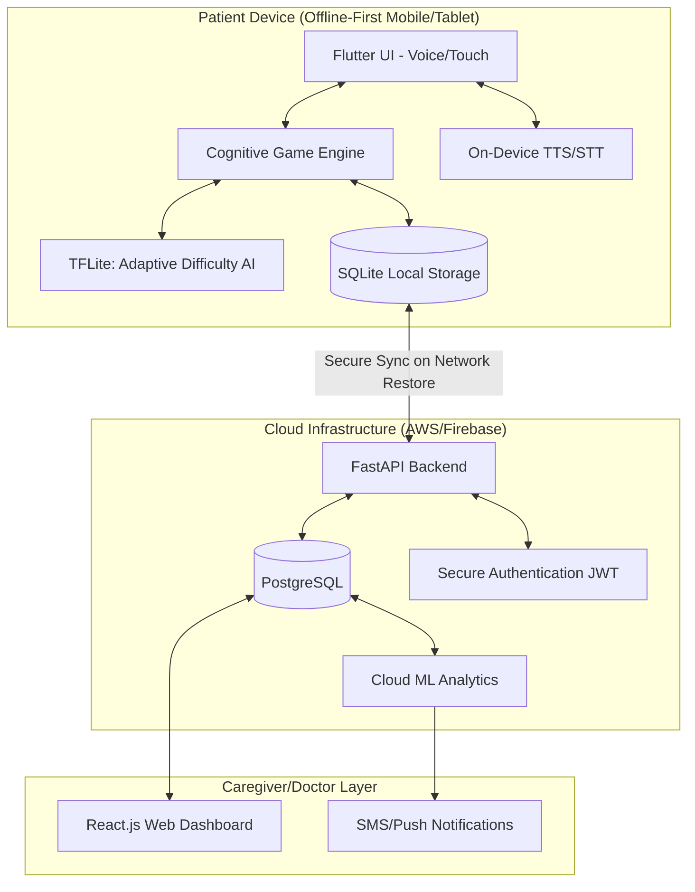
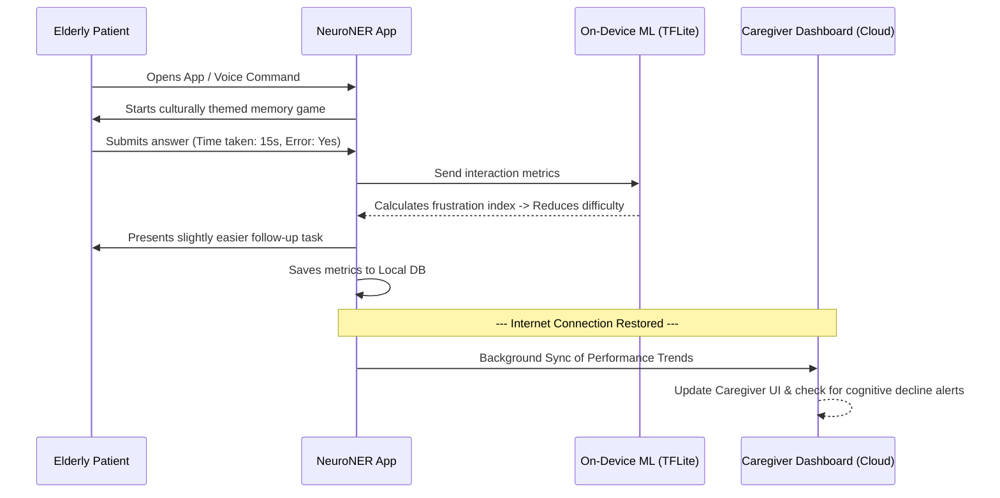

# NeuroNER: AI-Based Cognitive Gaming and Memory Assistance Platform
**Smart India Hackathon (SIH) 2026 - Idea Submission Blueprint & Project Documentation**

NeuroNER is a culturally adaptive, offline-first digital therapeutic platform providing cognitive engagement for elderly dementia patients in the North Eastern Region (NER), alongside robust monitoring tools for caregivers.

This repository contains the complete research, technical architecture, flowcharts, and slide-by-slide blueprint required for the SIH 2026 presentation.

---

## 🌟 1. Core Innovation & Differentiators (The "NER Advantage")

Unlike generic brain-training apps, NeuroNER is uniquely engineered for the infrastructural and demographic realities of the North Eastern Region:

1. **Culturally Familiar Cognitive Therapy**: Integrates NER-specific visuals, festivals, objects (e.g., Jaapi, Gamusa), and themes to reduce cognitive load and enhance reminiscence therapy.
2. **Offline-First Architecture**: Fully functional in low-connectivity rural areas. Games and AI personalization run locally on the device; data syncs securely to the cloud only when connectivity is restored.
3. **Voice-First Regional Accessibility**: Eliminates tech-literacy barriers. Uses conversational UI supporting regional languages (Assamese, Bengali, Bodo, etc.).
4. **On-Device AI Adaptation**: Uses Reinforcement Learning (Q-Learning) locally via TensorFlow Lite to adjust game difficulty dynamically based on real-time response times and error rates, preventing patient frustration.

---

## 📐 2. Technical Architecture & Flowcharts

The following diagrams illustrate the core workflows and system architecture. *(These can be directly used in the PPT).*

### A. High-Level System Architecture
This architecture ensures that the patient can use the app indefinitely without the internet, while caregivers get updates seamlessly when networks are available.

### B. User Journey & AI Adaptation Flow
How the AI Engine interacts with the patient in real-time.

---

## 🛠 3. Proposed Technology Stack

| Layer | Technologies | Justification |
| :--- | :--- | :--- |
| **Frontend (Patient)** | Flutter, Dart | High performance, cross-platform, accessible large-UI components. |
| **AI / Machine Learning** | TensorFlow Lite, Scikit-learn | TFLite allows the Reinforcement Learning model to run natively offline without server latency. |
| **Backend & APIs** | Python, FastAPI | High-speed asynchronous endpoints for processing sync requests when online. |
| **Database** | SQLite (Local), PostgreSQL (Cloud) | Seamless offline-to-online sync using a CRDT (Conflict-free Replicated Data Type) approach. |
| **Voice & NLP** | Bhashini API / Wav2Vec fine-tuned | Dedicated models for recognizing and synthesizing NER regional languages. |

---

## 📊 4. Feasibility, Challenges & Mitigations

| Risk / Challenge | Mitigation Strategy |
| :--- | :--- |
| **Low Internet Connectivity in Rural NER** | **Offline-First:** Core gameplay, AI adaptation, and reminders run completely on-device. Network is only needed for caregiver sync. |
| **Elderly Unfamiliarity with Tech** | **Voice-First UI:** Zero-login flow (device-bound auth). Large tap targets, voice prompts, and culturally familiar iconography reduce the learning curve. |
| **Language & Dialect Diversity** | **Localized NLP:** Integration of regional language datasets (Assamese, Bodo) for TTS/STT instead of relying purely on English. |
| **Data Privacy (HIPAA / DPDP Act)** | **Minimal Data Collection:** End-to-end encryption during sync, anonymized metrics on the cloud, and role-based access for caregivers. |

---

## 🔬 5. Research & References
*Our solution is grounded in established medical and technological research:*

1. **Cognitive Stimulation Therapy (CST)**: *Woods, B., et al. (2012).* Cochrane Database of Systematic Reviews. Demonstrates that structured cognitive engagement improves functioning in dementia patients.
2. **Reminiscence Therapy in Dementia**: Evidence shows that culturally specific cues (familiar regional objects, music, festivals) trigger stronger memory recall and reduce anxiety compared to generic stimuli.
3. **WHO Guidelines on ICOPE**: *Integrated Care for Older People*. Recommends digital health interventions for early cognitive decline monitoring.
4. **Offline-First mHealth Viability**: Implementing robust local storage (SQLite) with background sync is the standard for overcoming geographical healthcare barriers in rural settings.

---

## 📝 6. SIH 2026 Slide-by-Slide PPT Blueprint
*Use the content above to build the exact 6 slides required for the SIH template.*

### Slide 1: Title Page
*   **Problem Statement:** AI-Based Cognitive Gaming and Memory Assistance Platform for Elderly Dementia Patients in NER
*   **Idea Title:** NeuroNER: Culturally Adaptive AI Cognitive Assistant & Caregiver Platform
*   **Visual:** Minimalist brain/AI node intertwined with a subtle NER cultural motif.

### Slide 2: Idea Title / Proposed Solution
*   **Proposed Solution:** An offline-first, culturally adaptive digital therapeutic platform providing cognitive engagement for the elderly and monitoring tools for caregivers.
*   **Innovation:** Highlight **Culturally Familiar UI**, **Voice-First Accessibility**, and **Offline-First Architecture**.
*   **Visual:** Add the *User Journey Flowchart* (Section 2B) or a simple 3-card layout (Patient, AI Engine, Caregiver).

### Slide 3: Technical Approach
*   **Methodology:** Explain the AI/ML approach (On-device Q-Learning for difficulty adaptation based on interaction speed and error rates).
*   **Tech Stack:** List Frontend (Flutter), Backend (FastAPI), AI (TFLite), DB (SQLite/PostgreSQL).
*   **Visual:** MUST include the **High-Level System Architecture Flowchart** (Section 2A).

### Slide 4: Feasibility and Viability
*   **Feasibility:** Technically viable using proven mobile frameworks; operationally viable as it requires minimal caregiver setup.
*   **Challenges & Mitigations:** Directly copy the Table from **Section 4**.
*   **Visual:** Highlight the Offline Sync capability (Device -> No Signal -> Play -> Signal Restored -> Sync).

### Slide 5: Impact and Benefits
*   **Elderly Patients:** Reduced anxiety through culturally familiar exercises, improved daily routine adherence via gentle voice reminders.
*   **Caregivers:** Reduced burnout, automated tracking, real-time alerts for cognitive drops.
*   **NER Healthcare:** Scalable, cost-effective digital support that overcomes geographical barriers.
*   **Visual:** Impact Chain (Engagement → Tracking → Caregiver Visibility → Better Quality of Life).

### Slide 6: Research and References
*   Include the references listed in **Section 5** (CST, Reminiscence Therapy, WHO Guidelines).
*   Demonstrate that the "cultural familiarity" aspect is a scientifically validated therapeutic approach.
